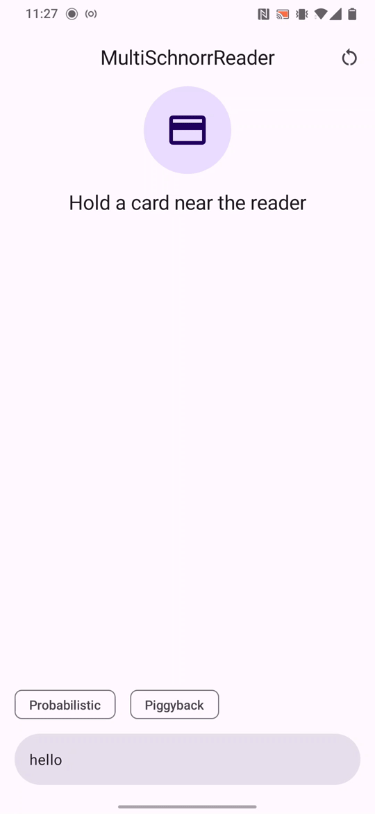

# MultiSchnorrReader

This is the card reader app for [MultiSchnorrApplet](https://github.com/jjanku/MultiSchnorrApplet). It implements the second party of the MultiSchnorr multi-signature protocol and works together with the applet to sign the entered message.



## Quickstart

1. Enter a message you wish to sign (ASCII, 32 chars max, will be padded by zero bytes).
2. Optionally, enable any of the optimizations below.
3. Hold a card with the applet installed near the back of the phone.
4. The phone establishes a new group with the card and subsequently signs the selected message. The next time the same card is used, the group key is not regenerated unless a different card was used in the meantime or the state of the app was reset.
5. Share the created signature by tapping on the displayed card. The output is in JSON format shown below and can be verified using the bundled script [verify.sage](./verify.sage).

```json
{
    "group": {
        "x": 97451645805052459860544257111023732257189445793566253538963642236580295025715,
        "y": 108036769450804252195526975423364810282508296824311571541272318567742502569515
    },
    "message": "68656c6c6f000000000000000000000000000000000000000000000000000000",
    "nonce": {
        "x": 49759968054553596793774934369901300558457422800809412179313891716327499250464,
        "y": 10595451351086868087048689286043643391031486060528063929912762467167368993502
    },
    "signature": 15093668512161333926586696895604108962007543668405816918671093546412761219977
}
```

### Optimizations

_Probabilistic_: Requests the card to speed up its computation by guessing some intermediate results. The app retries the signing process until the card succeeds. This option has no effect when the applet is compiled with `OperationSupport.EC_HW_XY = true`.

_Piggyback_: When enabled, the app signs the message as before but additionally asks the card to prepare for the next signature. The status "cached nonce" gets displayed. If you then disable this option, the following signature attempt will be faster, thanks to the preprocessing.

## Build

The easiest option is to build the project in [Android Studio](https://developer.android.com/studio).

Assuming Android SDK is setup properly, the app can also be built from the command line:

```bash
./gradlew assembleDebug
```

The output is located in `./app/build/outputs/`.

Alternatively, grab a pre-built APK from the _Releases_ section.
